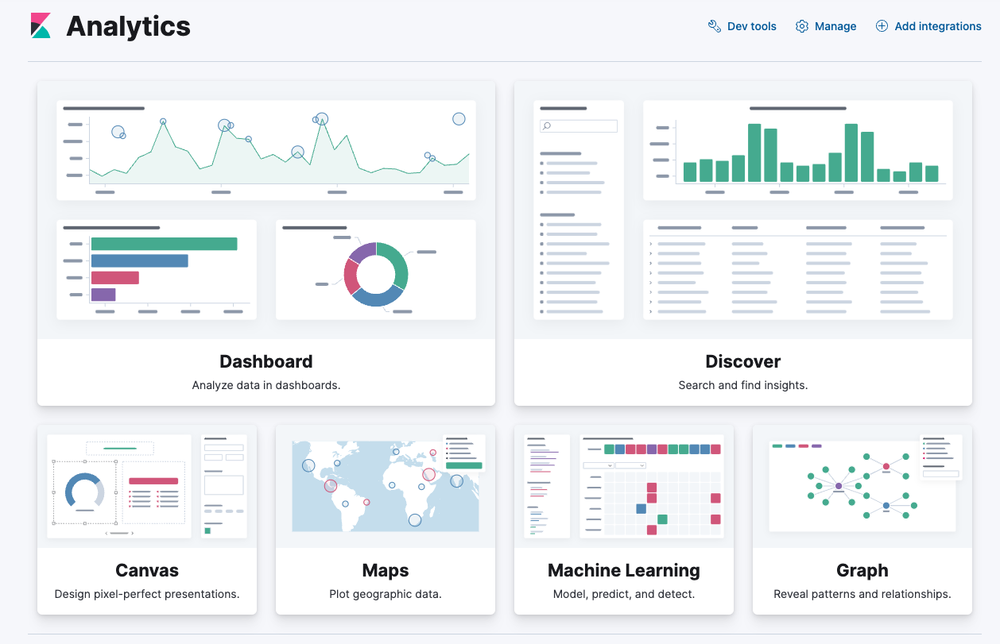

## Kibana Dashboard

Once our data is imported and we have a view generated, we can start exploring our data in Discover, or create visualizations in Dashboard - both found under the Analytics tab.

Regardless if you've worked with another BI tool before - Kibana Dashboard is pretty intuitive.

First you want to create a new Dashboard, and start editing it to create visualizations based on your dataset. 
This lets us get a first look at our Harry Potter data. Drag and drop fields to explore different charting options. With our limited options, we can mostly use the count of records as a horizontal axis in combination with the various other fields. One suggestion for better visualizations is to turn off the "Other" value for now, at least until we better clean our data.

Here is a quick example of some visuals that might be interesting.

In a few minutes, we found out we mostly read about males in Gryffindor, and that most wizards probably cannot produce a patronus. 

However, the most important thing we can learn from the Dashboard is that our data probably needs more cleaning. 

You will notice that not all columns in the dataset show up as fields. We notice the pop-up suggesting full text fields cannot be visualized, which might be the reason why. Therefore, if we want to get more meaningful information, we'll have to start processing our dataset. 

In the next sections we will explore how strings work in Elastic, and how to set up accurate mappings to define our fields and make search easier.

### [Go to Discover Queries](/2.%20Discover%20Queries.md)